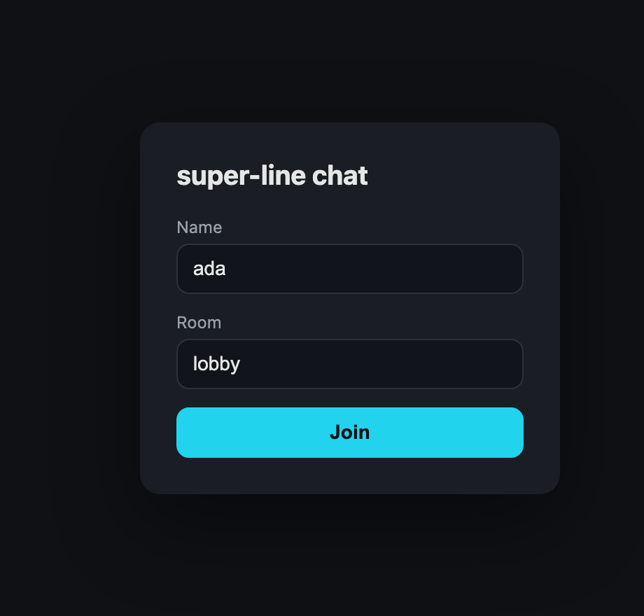
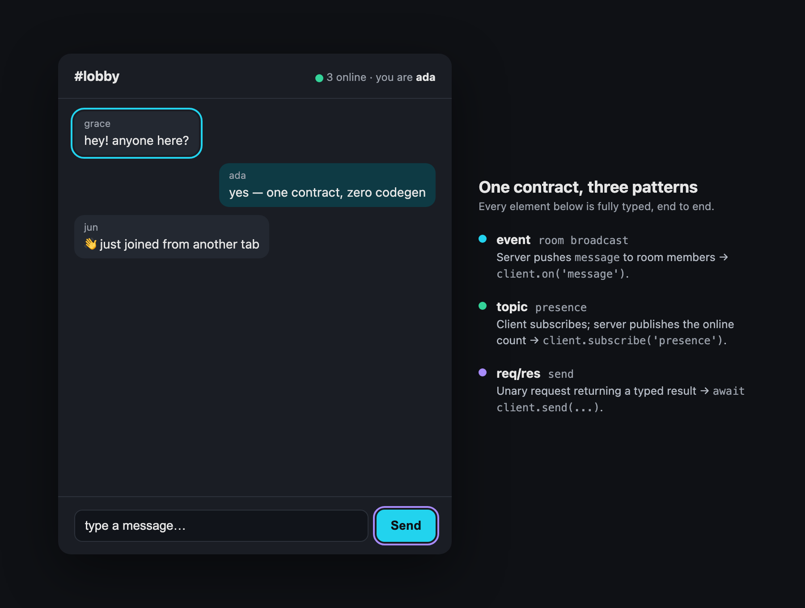

<div align="center">

<picture>
  <source media="(prefers-color-scheme: dark)" srcset="assets/logo-dark.svg">
  
</picture>

### End-to-end typesafe WebSockets — role-scoped contracts, req/res, rooms & topics

[](LICENSE)
[](https://www.typescriptlang.org/)
[](https://standardschema.dev)
[](#quickstart)

<br />


</div>

<br />

**super-line** is a typesafe WebSocket library for TypeScript. You write **one contract**; the server implements it and the client calls it with full end-to-end type inference — no codegen. The contract is split by **direction** (`clientToServer` / `serverToClient`) and scoped by **role** — a `user` and an `agent` connect to the same server and each get their own typed surface, with a `shared` base in common. Requests, events, topics, rooms, and node-to-node messaging share one connection, and everything fans out across processes through a pluggable adapter (in-memory for one node, Redis for many).

## Contents

- [Features](#features)
- [Install](#install)
- [Quickstart](#quickstart)
- [Concepts: roles, direction & the interaction flavors](#concepts-roles-direction--the-interaction-flavors)
- [React](#react)
- [Auth, middleware & validation](#auth-middleware--validation)
- [Reconnection & delivery](#reconnection--delivery)
- [Multi-node (Redis)](#multi-node-redis)
- [Examples](#examples)
- [Agent skill](#agent-skill)
- [Comparison & FAQ](#comparison--faq)
- [Development](#development)
- [Packages](#packages)
- [Status](#status)

## Features

| | |
| --- | --- |
| 🧩 **Contract-first** | One schema is the SSOT; types flow to both ends with zero codegen. |
| 🎭 **Role-scoped** | One contract, many client roles (`user`, `agent`…) — each gets its own surface + `ctx`; cross-role calls get `NOT_FOUND`. |
| 🛡️ **Validator-agnostic** | Any [Standard Schema](https://standardschema.dev) validator — Zod, Valibot, ArkType. |
| ↔️ **Req/res** | Unary `await client.x()` with typed errors, timeout & `AbortSignal`. |
| 📣 **Events & rooms** | Server-pushed events; server-controlled room broadcasts. |
| 📡 **Topics** | Client-subscribed pub/sub streams, authorized server-side. |
| 🖧 **Inter-server** | Typed `emitServer` / `onServer` for node-to-node coordination. |
| 🔌 **Composable** | Attaches to your `http.Server`; lifecycle hooks + middleware. |
| 🔁 **Resilient client** | Auto-reconnect, re-subscribe, in-flight reject, queue-and-flush. |
| 📈 **Scales** | Rooms, topics & inter-server events fan out across nodes via an adapter (Redis included). |

## Install

```bash
pnpm add @super-line/core @super-line/server @super-line/client zod
# optional
pnpm add @super-line/adapter-redis   # multi-node fan-out
pnpm add @super-line/react           # React hooks
```

Requirements: **Node 18+** (server). The client uses the global `WebSocket` (browsers, and Node 22+); on older Node, pass `{ WebSocket }`.

## Quickstart

### 1. Define the contract (shared)

```ts
import { z } from 'zod'
import { defineContract } from '@super-line/core'

export const chat = defineContract({
  shared: {
    clientToServer: {
      join: { input: z.object({ room: z.string() }), output: z.object({ ok: z.boolean() }) },
    },
    serverToClient: {
      // { payload } = push event; add `subscribe: true` to make it a client-subscribable topic
      message: { payload: z.object({ room: z.string(), text: z.string(), from: z.string() }) },
      presence: { payload: z.object({ room: z.string(), count: z.number() }), subscribe: true },
    },
  },
  roles: {
    user: {
      clientToServer: {
        send: { input: z.object({ room: z.string(), text: z.string() }), output: z.object({ id: z.string() }) },
      },
    },
  },
})
```

> One role here (`user`). Add more under `roles` — e.g. an `agent` with its own
> `clientToServer` verbs — and each client gets only its role's surface.

### 2. Server

```ts
import http from 'node:http'
import { createSocketServer } from '@super-line/server'
import { chat } from './contract'

const server = http.createServer() // or pass your Express/Fastify http.Server
const srv = createSocketServer(chat, {
  server,
  authenticate: (req) => {
    const name = new URL(req.url!, 'http://x').searchParams.get('name')
    if (!name) throw new Error('unauthorized') // throw -> 401 at the upgrade, no socket
    return { role: 'user' as const, ctx: { name } } // role + ctx; ctx in every handler
  },
})

srv.implement({
  // shared requests (every role); ctx is the role's ctx, conn carries conn.role
  shared: {
    join: async ({ room }, _ctx, conn) => {
      srv.room(room).add(conn)                                          // server-controlled membership
      srv.forRole('user').publish('presence', { room, count: srv.room(room).size })
      return { ok: true }
    },
  },
  user: {
    send: async ({ room, text }, ctx) => {
      srv.room(room).broadcast('message', { room, text, from: ctx.name }) // -> client.on('message')
      return { id: crypto.randomUUID() }
    },
  },
})

server.listen(3000)
```

### 3. Client

```ts
import { createClient } from '@super-line/client'
import { chat } from './contract'

const client = createClient(chat, {
  url: 'ws://localhost:3000',
  role: 'user',                 // narrows the surface to shared ∪ user; sent to authenticate to verify
  params: { name: 'ada' },     // -> ?name=ada, read in authenticate
  validate: 'inbound',          // optional: re-validate server->client payloads (great in dev)
})

client.on('message', (m) => console.log(`${m.from}: ${m.text}`)) // typed
const sub = client.subscribe('presence', (p) => console.log(`${p.count} online`))

await client.join({ room: 'lobby' })
await client.send({ room: 'lobby', text: 'hi' }) // typed input/output; throws typed SocketError on failure

sub.unsubscribe()
client.close()
```

<div align="center"></div>

## Concepts: roles, direction & the interaction flavors

The contract has two axes. **Role** is the outer key (`shared` + one block per role); a connection's role is fixed at the upgrade and decides which surface and `ctx` it gets. **Direction** is the inner key — `clientToServer` and `serverToClient` — and the shape of each entry picks the flavor:

<div align="center"></div>

| Flavor | Contract entry | Direction | Who controls delivery | Use it for |
| --- | --- | --- | --- | --- |
| **request** | `clientToServer: { input, output }` | client → server → client | one response per call | actions/queries: `send`, `join`, `getHistory` |
| **event** | `serverToClient: { payload }` | server → client (push) | server picks recipients | room broadcasts, notifications, direct push |
| **topic** | `serverToClient: { payload, subscribe: true }` | server → many clients | client subscribes (server authorizes) | live streams: prices, presence, feeds |
| **room** | (server API) | server → members | server-managed membership | grouping connections to broadcast a shared event |
| **serverToServer** | `serverToServer: { schema }` | node → other nodes | the emitting server | cluster coordination: rebalance, cache-invalidate |

**Rules of thumb:** need a reply? a `clientToServer` request. Pushing to clients *you* choose? an event (often via `room.broadcast`). Clients opting into a stream? a `subscribe: true` topic. Coordinating other server processes? `serverToServer`. A "room" is a mixed-role, server-controlled group whose `broadcast` delivers a **shared** event to its members.

**Roles.** Add a block under `roles` per audience. The effective surface for a role is `shared ∪ roles[R]`, and `authenticate` returns `{ role, ctx }` so each role gets its own `ctx` type too. A method that isn't on a connection's surface is rejected with `NOT_FOUND` — the client-side types hide it, and the server enforces it.

```ts
roles: {
  user:  { clientToServer: { say:      { input: …, output: … } } },
  agent: { clientToServer: { announce: { input: …, output: … } } },
}
// const agent = createClient(api, { url, role: 'agent' })
// agent.say(...)   // ❌ compile error — `say` is on the user surface
```

## React

```tsx
import { useState } from 'react'
import { createClient } from '@super-line/client'
import { createSocketReact } from '@super-line/react'
import { chat } from './contract'

const { Provider, useRequest, useEvent, useSubscription } = createSocketReact<typeof chat, 'user'>()

function Root() {
  const [client] = useState(() => createClient(chat, { url: 'ws://localhost:3000', role: 'user', params: { name: 'ada' } }))
  return <Provider client={client}><Room room="lobby" /></Provider>
}

function Room({ room }: { room: string }) {
  const { call: send, isLoading } = useRequest('send')
  const presence = useSubscription('presence')   // latest { room, count } | undefined
  const [log, setLog] = useState<string[]>([])
  useEvent('message', (m) => setLog((l) => [...l, `${m.from}: ${m.text}`]))
  // ... render log + an input that calls send({ room, text })
}
```

## Auth, middleware & validation

```ts
const srv = createSocketServer(chat, {
  server,
  // 1. authenticate once at the HTTP upgrade — return { role, ctx }, or throw to reject with 401.
  //    The client's `role` option is a claim sent as a query param — verify it against the credential.
  authenticate: (req) => {
    const user = verify(tokenFrom(req))
    return { role: user.role, ctx: { user } } // role-discriminated; ctx is per-role
  },

  // 2. authorize each topic subscribe — return false or throw to deny
  authorizeSubscribe: (topic, ctx) => ctx.user.canRead(topic),

  // 3. middleware runs before req/subscribe handlers — call next() or throw to short-circuit
  use: [
    async (ctx, info, next) => { rateLimit(ctx.user, info.name); await next() },
    async (_ctx, info, next) => { const t = Date.now(); await next(); metric(info.name, Date.now() - t) },
  ],

  onConnection: (conn, ctx) => log('joined', ctx.user.id),
  onDisconnect: (conn, ctx) => cleanup(conn),
  onError: (err, info) => report(err, info),
})
```

**Validation.** The server **always** validates inbound messages (client input is untrusted). The client doesn't validate server→client payloads by default; opt in with `validate: 'inbound'` to catch contract drift between a deployed client and an updated server. Errors surface as a typed `SocketError`:

```ts
import { SocketError } from '@super-line/core'
try {
  await client.send({ room: 'lobby', text: 'hi' })
} catch (e) {
  if (e instanceof SocketError && e.code === 'UNAUTHORIZED') relogin()
}
// codes: BAD_REQUEST | UNAUTHORIZED | FORBIDDEN | NOT_FOUND | TIMEOUT | VALIDATION | DISCONNECTED | INTERNAL
```

## Reconnection & delivery

The client is resilient by default:

- **Auto-reconnect** with exponential backoff + full jitter (configurable; `reconnect: false` to disable).
- **Topics re-subscribe automatically** on reconnect.
- **In-flight requests reject** with `DISCONNECTED` when the socket drops; calls made *while* reconnecting are **queued and flushed** once connected.

Delivery is **at-most-once**: messages sent while a client is offline are not replayed (correct for cursors, presence, live prices). Rooms are server-controlled, so after a reconnect the client re-runs its own join flow. Session resume/replay is not built yet — see [Status](#status).

## Multi-node (Redis)

The same code scales across processes — give every server a shared adapter:

```ts
import { createRedisAdapter } from '@super-line/adapter-redis'
const srv = createSocketServer(chat, { server, adapter: createRedisAdapter('redis://localhost:6379') })
```

Now `room.broadcast`, `srv.publish` / `forRole(r).publish`, **and** `srv.emitServer` fan out across **any** node. Without an adapter, a per-server in-memory adapter is used (single node).

```ts
// node-to-node coordination (contract.serverToServer.rebalance: { shard: number })
srv.onServer('rebalance', ({ shard }) => moveShard(shard)) // hear from peers (excludes self)
srv.emitServer('rebalance', { shard: 3 })                  // tell every other node
```

## Examples

```bash
pnpm install

# Node end-to-end (one server + two clients, prints the flow):
pnpm --filter @super-line/example-chat start

# Browser React chat (Vite + WS server; open two tabs to chat live):
pnpm --filter @super-line/example-react-chat dev   # http://localhost:5173

# Token auth (good token authorized, bad token rejected at the upgrade):
pnpm --filter @super-line/example-auth start

# Multi-node fan-out via Redis (needs Docker/Redis):
docker run --rm -p 6379:6379 redis:7
pnpm --filter @super-line/example-scaling start
```

## Agent skill

This repo ships an **agent skill** that teaches AI coding agents how to use super-line — the role + direction contract model, the interaction flavors, auth, reconnection, scaling, testing, and common pitfalls. It lives in [`skills/super-line`](skills/super-line) (`SKILL.md` + `REFERENCE.md` + `RECIPES.md`).

Since skills aren't delivered via npm, copy it into your agent's skills directory:

```bash
# project-local (this repo or a consumer project)
mkdir -p .claude/skills && cp -r skills/super-line .claude/skills/
# or globally, for all your projects
cp -r skills/super-line ~/.claude/skills/
```

It activates when you import from `@super-line/*` or mention super-line.

## Comparison & FAQ

| | super-line | Socket.IO | tRPC | raw `ws` |
| --- | :---: | :---: | :---: | :---: |
| Typesafe contract | ✅ | ⚠️ types-only | ✅ | ❌ |
| Runtime validation | ✅ | ❌ | ✅ | ❌ |
| Per-role contracts | ✅ | ❌ | ❌ | ❌ |
| Req/res | ✅ | ack callbacks | ✅ | ❌ |
| Rooms | ✅ | ✅ | ❌ | ❌ |
| Topics (pub/sub) | ✅ | ⚠️ via rooms | subscriptions | ❌ |
| Inter-server messaging | ✅ | ✅ | ❌ | ❌ |
| Multi-node | ✅ adapter | ✅ adapter | ❌ | ❌ |
| Zero codegen | ✅ | ✅ | ✅ | n/a |

**Why not Socket.IO?** Socket.IO splits its types into `ClientToServerEvents` / `ServerToClientEvents` / `InterServerEvents` interfaces you maintain by hand as **positional generics** (easy to swap), with no runtime validation. super-line keeps the same directional split but in **one shared object** (can't misorder, can't drift), validates inbound automatically, and adds something Socket.IO doesn't have: **per-role contracts** — one server serving `user` and `agent` clients distinct, enforced surfaces.

**Why not tRPC?** tRPC is excellent for request/response (and SSE subscriptions), but doesn't model rooms or client-driven pub/sub topics. super-line is purpose-built for bidirectional realtime.

**Do I need Redis?** No — a single node uses the in-memory adapter. Add Redis only when you run more than one process.

**Does the client work in the browser?** Yes (and Node 22+). It uses the global `WebSocket`; pass `{ WebSocket }` on older runtimes.

**How are types shared?** Put the contract in a shared package/module both sides import. No build step, no generated files.

## Development

```bash
pnpm test        # vitest (integration over real loopback; redis test auto-skips without Docker)
pnpm typecheck   # tsc across all packages
pnpm lint        # oxlint
pnpm build       # tsup, dual ESM + CJS + d.ts
./scripts/screenshots.sh   # re-render the README mockups (headless Chrome)
```

## Packages

| Package | Purpose |
| --- | --- |
| [`@super-line/core`](packages/core) | `defineContract` (roles + direction), validation, wire protocol, `Serializer` / `Adapter` interfaces, `SocketError` |
| [`@super-line/server`](packages/server) | `createSocketServer` over `ws`: role-keyed `implement`, rooms, topics, `forRole`, `emitServer`/`onServer`, middleware, in-memory adapter |
| [`@super-line/client`](packages/client) | `createClient` (role-scoped surface, reconnect, typed calls, `on` / `subscribe`) |
| [`@super-line/adapter-redis`](packages/adapter-redis) | Redis Pub/Sub adapter for multi-node fan-out |
| [`@super-line/react`](packages/react) | `createSocketReact<C, Role>` → `useRequest` / `useEvent` / `useSubscription` |

## Status

Pre-1.0. **Implemented:** role-scoped contracts, req/res, events, rooms, topics, inter-server (`emitServer`/`onServer`), auth, reconnect, middleware, in-memory + Redis adapters, React hooks. **Not yet:** fire-and-forget client→server signals (every client→server is req/res today), mutable per-connection state, NATS adapter, wildcard/retained topics, session resume/replay, parameterized-topic type inference (topics are typed by exact contract key for now), backpressure safeguards.

## License

[MIT](LICENSE) © Mert
