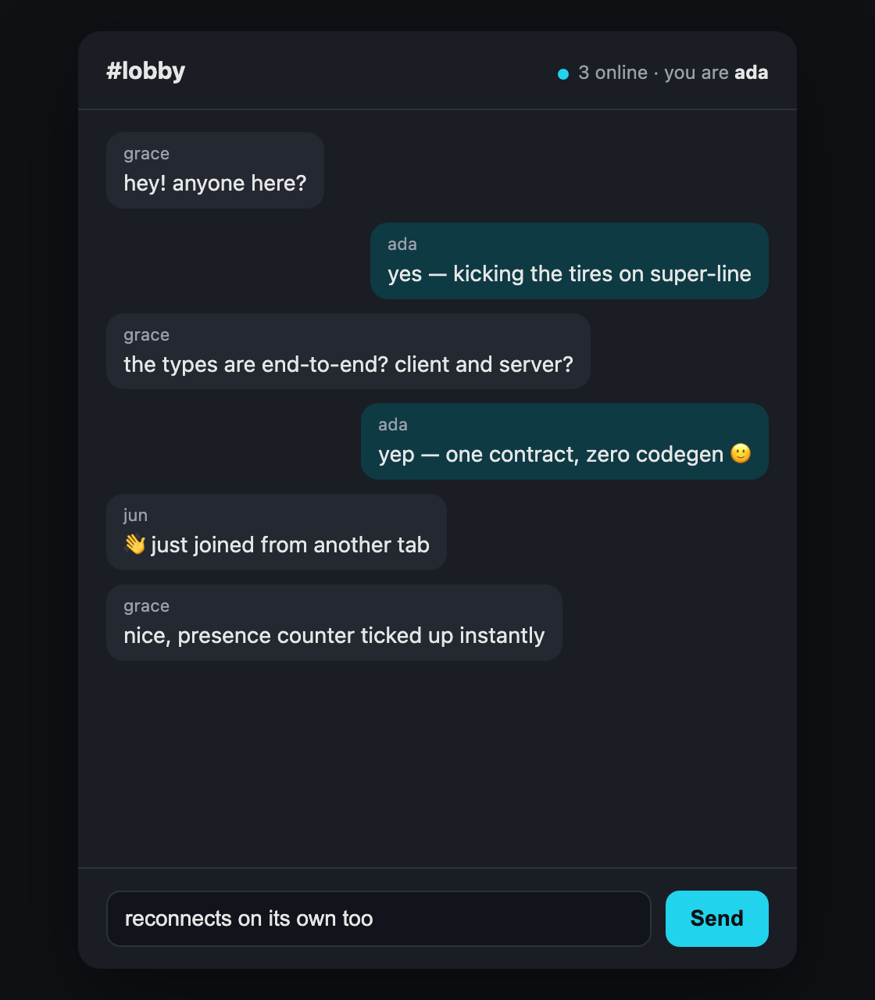

<div align="center">

<picture>
  <source media="(prefers-color-scheme: dark)" srcset="assets/logo-dark.svg">
  
</picture>

### End-to-end typesafe WebSockets — role-scoped contracts, req/res, rooms & topics

[](LICENSE)
[](https://www.typescriptlang.org/)
[](https://standardschema.dev)
[](https://mertdogar.github.io/super-line/)

<br />



</div>

<br />

**super-line** is a typesafe WebSocket library for TypeScript. You write **one contract**; the server implements it and the client calls it with full end-to-end type inference — no codegen. The contract is split by **direction** (`clientToServer` / `serverToClient`) and scoped by **role** — a `user` and an `agent` connect to the same server and each get their own typed surface, with a `shared` base in common. Requests, events, topics, rooms, and node-to-node messaging share one connection, and everything fans out across processes through a pluggable adapter (in-memory for one node, Redis for many).

> 📖 **Full documentation: [mertdogar.github.io/super-line](https://mertdogar.github.io/super-line/)** — guides, the complete API reference, and runnable examples.

## Contents

- [Features](#features)
- [Install](#install)
- [Quickstart](#quickstart)
- [Documentation](#documentation)
- [Examples](#examples)
- [Use with your AI agent](#use-with-your-ai-agent)
- [Comparison & FAQ](#comparison--faq)
- [Development](#development)
- [Packages](#packages)
- [Status](#status)

## Features

| | |
| --- | --- |
| 🧩 **Contract-first** | One schema is the SSOT; types flow to both ends with zero codegen. |
| 🎭 **Role-scoped** | One contract, many client roles (`user`, `agent`…) — each gets its own surface + `ctx`; cross-role calls get `NOT_FOUND`. |
| 🛡️ **Validator-agnostic** | Any [Standard Schema](https://standardschema.dev) validator — Zod, Valibot, ArkType. |
| ↔️ **Req/res** | Unary `await client.x()` with typed errors, timeout & `AbortSignal`. |
| 📣 **Events & rooms** | Server-pushed events; server-controlled room broadcasts. |
| 📡 **Topics** | Client-subscribed pub/sub streams, authorized server-side. |
| 🖧 **Inter-server** | Typed `emitServer` / `onServer` for node-to-node coordination. |
| 📨 **Server→client req/res** | `await srv.toConn(id).request(...)` — ask a client and await a typed reply, across nodes. |
| 🛰️ **Presence & introspection** | `srv.local.*` (sync) + `srv.cluster.*` (counts, topology, `isOnline`) backed by a Redis registry. |
| 🎯 **Targeted send** | `srv.toConn(id)` / `srv.toUser(uid)` emit or kick any connection on any node. |
| 🔌 **Composable** | Attaches to your `http.Server`; lifecycle hooks + middleware. |
| 🔁 **Resilient client** | Auto-reconnect, re-subscribe, in-flight reject, queue-and-flush. |
| 📈 **Scales** | Rooms, topics, inter-server events & presence fan out across nodes via an adapter (Redis included). |

## Install

```bash
pnpm add @super-line/core @super-line/server @super-line/client zod
# optional
pnpm add @super-line/adapter-redis   # multi-node fan-out
pnpm add @super-line/react           # React hooks
```

Requirements: **Node 18+** (server). The client uses the global `WebSocket` (browsers, and Node 22+); on older Node, pass `{ WebSocket }`.

## Quickstart

### 1. Define the contract (shared)

```ts
import { z } from 'zod'
import { defineContract } from '@super-line/core'

export const chat = defineContract({
  shared: {
    clientToServer: {
      join: { input: z.object({ room: z.string() }), output: z.object({ ok: z.boolean() }) },
    },
    serverToClient: {
      // { payload } = push event; add `subscribe: true` to make it a client-subscribable topic
      message: { payload: z.object({ room: z.string(), text: z.string(), from: z.string() }) },
      presence: { payload: z.object({ room: z.string(), count: z.number() }), subscribe: true },
    },
  },
  roles: {
    user: {
      clientToServer: {
        send: { input: z.object({ room: z.string(), text: z.string() }), output: z.object({ id: z.string() }) },
      },
    },
  },
})
```

> One role here (`user`). Add more under `roles` — e.g. an `agent` with its own
> `clientToServer` verbs — and each client gets only its role's surface.

### 2. Server

```ts
import http from 'node:http'
import { createSocketServer } from '@super-line/server'
import { chat } from './contract'

const server = http.createServer() // or pass your Express/Fastify http.Server
const srv = createSocketServer(chat, {
  server,
  authenticate: (req) => {
    const name = new URL(req.url!, 'http://x').searchParams.get('name')
    if (!name) throw new Error('unauthorized') // throw -> 401 at the upgrade, no socket
    return { role: 'user' as const, ctx: { name } } // role + ctx; ctx in every handler
  },
})

srv.implement({
  shared: {
    join: async ({ room }, _ctx, conn) => {
      srv.room(room).add(conn)                                          // server-controlled membership
      srv.forRole('user').publish('presence', { room, count: srv.room(room).size })
      return { ok: true }
    },
  },
  user: {
    send: async ({ room, text }, ctx) => {
      srv.room(room).broadcast('message', { room, text, from: ctx.name }) // -> client.on('message')
      return { id: crypto.randomUUID() }
    },
  },
})

server.listen(3000)
```

### 3. Client

```ts
import { createClient } from '@super-line/client'
import { chat } from './contract'

const client = createClient(chat, {
  url: 'ws://localhost:3000',
  role: 'user',                 // narrows the surface to shared ∪ user; sent to authenticate to verify
  params: { name: 'ada' },     // -> ?name=ada, read in authenticate
})

client.on('message', (m) => console.log(`${m.from}: ${m.text}`)) // typed
const sub = client.subscribe('presence', (p) => console.log(`${p.count} online`))

await client.join({ room: 'lobby' })
await client.send({ room: 'lobby', text: 'hi' }) // typed input/output; throws typed SocketError on failure

sub.unsubscribe()
client.close()
```

### Presence & cross-node reach (optional)

```ts
// server: identify connections so the cluster view + toUser can find them
createSocketServer(chat, { server, authenticate, identify: (conn) => conn.ctx.userId })

await srv.cluster.count()                 // total connections cluster-wide
await srv.isOnline('u42')                 // connected on any node?
srv.toUser('u42').emit('message', { ... }) // reach every device, any node

// ask a specific client and await its typed reply (across nodes):
const { ok } = await srv.toConn(connId).request('confirm', { q: 'Deploy now?' })
// client side: client.implement({ confirm: async ({ q }) => ({ ok: true }) })
```

See [Introspection & presence](https://mertdogar.github.io/super-line/guide/introspection-and-presence) for the full surface.

## Documentation

The full docs live at **[mertdogar.github.io/super-line](https://mertdogar.github.io/super-line/)**:

- **Start here** — [Getting started](https://mertdogar.github.io/super-line/guide/getting-started) · [The contract](https://mertdogar.github.io/super-line/guide/the-contract) (roles, direction & the five flavors)
- **Guides** — [Requests](https://mertdogar.github.io/super-line/guide/requests) · [Events & rooms](https://mertdogar.github.io/super-line/guide/events-rooms) · [Topics](https://mertdogar.github.io/super-line/guide/topics) · [Roles & auth](https://mertdogar.github.io/super-line/guide/roles-auth) · [Middleware & lifecycle](https://mertdogar.github.io/super-line/guide/middleware-lifecycle) · [Error handling](https://mertdogar.github.io/super-line/guide/errors) · [Reconnection & delivery](https://mertdogar.github.io/super-line/guide/reconnection-delivery) · [Serialization](https://mertdogar.github.io/super-line/guide/serialization) · [Scaling & adapters](https://mertdogar.github.io/super-line/guide/scaling-adapters) · [React](https://mertdogar.github.io/super-line/guide/react) · [Testing](https://mertdogar.github.io/super-line/guide/testing)
- **[API reference](https://mertdogar.github.io/super-line/reference/)** — generated from source: every export, option, and type across the five packages.

## Examples

```bash
pnpm install

# Node end-to-end — a human (user) and an AI (agent) in one room:
pnpm --filter @super-line/example-chat start

# Browser React chat (Vite + WS server; open two tabs to chat live):
pnpm --filter @super-line/example-react-chat dev   # http://localhost:5173

# Token auth with roles (admin-only `secret`; user gets NOT_FOUND):
pnpm --filter @super-line/example-auth start

# Multi-node fan-out via Redis + serverToServer (needs Docker/Redis):
docker run --rm -p 6379:6379 redis:7
pnpm --filter @super-line/example-scaling start
```

More on each: [examples on the docs site](https://mertdogar.github.io/super-line/examples/).

## Use with your AI agent

super-line ships an **agent guide** — the role + direction model, the interaction flavors, auth, scaling, testing, and common pitfalls — so your AI coding agent writes correct super-line code instead of guessing. It lives in [`skills/super-line`](skills/super-line): Claude Code gets the full skill (`SKILL.md` + `REFERENCE.md` + `RECIPES.md`, progressive disclosure); other agents get a condensed `AGENTS.md`.

```bash
# Claude Code (project-local; or ~/.claude/skills for all projects)
npx degit mertdogar/super-line/skills/super-line .claude/skills/super-line
```

For **Cursor, GitHub Copilot, and other agents** (one condensed file + where to put it), see the guide: **[Use with your AI agent](https://mertdogar.github.io/super-line/guide/ai-agents)**.

## Comparison & FAQ

| | super-line | Socket.IO | tRPC | raw `ws` |
| --- | :---: | :---: | :---: | :---: |
| Typesafe contract | ✅ | ⚠️ types-only | ✅ | ❌ |
| Runtime validation | ✅ | ❌ | ✅ | ❌ |
| Per-role contracts | ✅ | ❌ | ❌ | ❌ |
| Req/res | ✅ | ack callbacks | ✅ | ❌ |
| Rooms | ✅ | ✅ | ❌ | ❌ |
| Topics (pub/sub) | ✅ | ⚠️ via rooms | subscriptions | ❌ |
| Inter-server messaging | ✅ | ✅ | ❌ | ❌ |
| Server→client req/res | ✅ | ⚠️ ack-less | ❌ | ❌ |
| Presence / introspection | ✅ cluster-wide | ⚠️ rooms only | ❌ | ❌ |
| Multi-node | ✅ adapter | ✅ adapter | ❌ | ❌ |
| Zero codegen | ✅ | ✅ | ✅ | n/a |

**Why not Socket.IO?** Socket.IO splits its types into `ClientToServerEvents` / `ServerToClientEvents` / `InterServerEvents` interfaces you maintain by hand as **positional generics** (easy to swap), with no runtime validation. super-line keeps the same directional split but in **one shared object** (can't misorder, can't drift), validates inbound automatically, and adds something Socket.IO doesn't have: **per-role contracts**. More in the [comparison & FAQ](https://mertdogar.github.io/super-line/guide/comparison-faq).

**Do I need Redis?** No — a single node uses the in-memory adapter. Add Redis only when you run more than one process.

**Does the client work in the browser?** Yes (and Node 22+). It uses the global `WebSocket`; pass `{ WebSocket }` on older runtimes.

## Development

```bash
pnpm test        # vitest (integration over real loopback; redis test auto-skips without Docker)
pnpm typecheck   # tsc across all packages
pnpm lint        # oxlint
pnpm build       # tsup, dual ESM + CJS + d.ts
pnpm docs:dev    # run the docs site locally (VitePress + TypeDoc)
```

## Packages

| Package | Purpose |
| --- | --- |
| [`@super-line/core`](packages/core) | `defineContract` (roles + direction), validation, wire protocol, `Serializer` / `Adapter` interfaces, `SocketError` |
| [`@super-line/server`](packages/server) | `createSocketServer` over `ws`: role-keyed `implement`, rooms, topics, `forRole`, `emitServer`/`onServer`, server→client requests (`toConn`/`toUser`), local + cluster introspection, heartbeat, middleware, in-memory adapter |
| [`@super-line/client`](packages/client) | `createClient` (role-scoped surface, reconnect, typed calls, `on` / `subscribe`) |
| [`@super-line/adapter-redis`](packages/adapter-redis) | Redis Pub/Sub adapter for multi-node fan-out |
| [`@super-line/react`](packages/react) | `createSocketReact<C, Role>` → `useRequest` / `useEvent` / `useSubscription` |

## Status

Pre-1.0. **Implemented:** role-scoped contracts, req/res, events, rooms, topics, inter-server (`emitServer`/`onServer`), auth, reconnect, middleware, in-memory + Redis adapters, React hooks. **Not yet:** fire-and-forget client→server signals (every client→server is req/res today), mutable per-connection state, NATS adapter, wildcard/retained topics, session resume/replay, parameterized-topic type inference (topics are typed by exact contract key for now), backpressure safeguards.

## License

[MIT](LICENSE) © Mert
