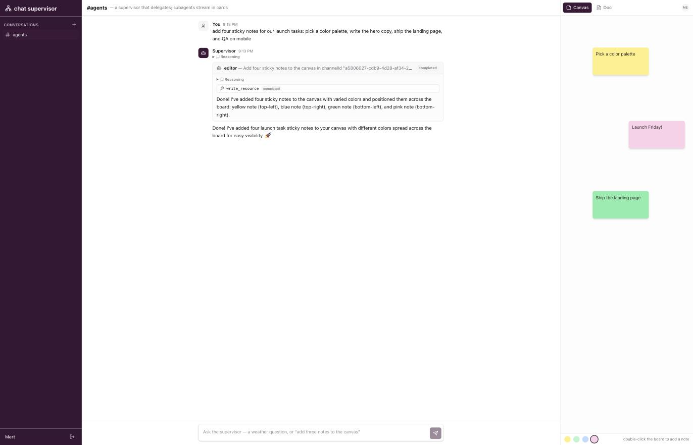

# chat-supervisor — a canvas a human and an AI agent edit live

A shared sticky-note **canvas** (and a block **doc**) that a person and a server-side agent edit at
the same time, inside a chat channel. You drag notes in the pane on the right; you ask the agent
"add a note for each launch task" in the chat on the left, and its notes land on the *same* board
mid-sentence. The collaboration surface is a `@super-line/plugin-chat` **channel resource** — a
host-declared [CRDT document](https://super-line.dogar.biz/collections/crdt-documents) the plugin
attaches to the channel — and the agent is a Mastra **supervisor** that delegates canvas edits to an
**editor** subagent (and weather look-ups to a **worker**), the whole turn streaming into the channel
as one message. It's the [super-harness](https://github.com/mertdogar/super-harness) `examples/web`
flow rebuilt on **super-line alone** — no bespoke harness, no bespoke canvas store.



What it demonstrates:

- **Human + agent on one CRDT resource.** Each channel is auto-seeded with a sticky-note **canvas**
  and a block **doc** ([channel resources](../../docs/how-to/chat-resources.md), PLAN-chat-resources).
  You drag notes and edit blocks through the native `useDoc` handle; the `editor` subagent writes
  the *same* documents through the acked `write_resource` tool path — ask "add a note that says
  hello world" and watch it pop onto the board mid-turn while the delegation streams on the left.
  Both sides merge (id-keyed maps), and presence avatars in the pane header show who's in the doc.
- **Subagent turns render as their own cards.** A delegation's tool part is the card anchor; the
  subagent's lane (`parent`-nested parts) streams inside it, with a live status badge
  (running → completed/error). Multiple delegations = multiple cards in one message.
- **Everything survives reload.** Parts are rows, checkpointed ~1s while streaming — reload
  mid-turn and the cards re-render from the database, then keep streaming. Canvas and doc are
  durable CRDT documents (`collections-crdt-libsql`), so the board survives restarts too.
- **The wiring is a handful of library calls.** `@super-line/plugin-chat/mastra`'s `mastraEngine`
  takes the PLAIN Mastra agents and owns the `delegate` tool (injected per stream call via
  toolsets — the agents never declare it), the lanes and `parent` nesting, and the harness-ported
  chunk mapping. The editor's resource tools come from `chatAgentTools` on the bot's own
  connection (the server re-authorizes every call). `provisionChatBot` mints the identity;
  `onChatMessage` runs the channel loop, turns serialized per channel.
- **Reasoning streams too.** Agents enable Anthropic extended thinking via `defaultOptions` on
  their own plain Agent (Mastra merges it under the engine's per-lane options), so subagents think
  inside their cards; thinking tokens land as `reasoning` parts, auto-opened while live.
- **The bot is a regular user** (plugin-auth API key) on the same WebSocket wire as the browser —
  it passes the exact same membership gate on the resources as any human member.

## Run it

```bash
pnpm install                       # repo root
cd examples/chat-supervisor
echo 'AI_GATEWAY_API_KEY=…' > .env # Vercel AI Gateway key (also read from ../collections-chat/.env)
pnpm dev                           # server on :8792 + vite on :5173x
```

Sign up, then try the headline first:

- **canvas/doc** — *“add a sticky note that says ship it”* or *“draft a 3-point launch brief in the
  doc”* → the supervisor delegates to the editor, which writes the shared resource live while you
  watch. Double-click the board to add your own notes and drag them around at the same time — both
  sides merge.
- **weather** — *“compare the weather in Ankara and Berlin”* → the supervisor delegates to the
  worker; reload mid-stream to see the durable floor (parts re-render from the database, then keep
  streaming).

`MODEL` (default `anthropic/claude-haiku-4.5`) picks the gateway model for all agents.

## Layout

- `src/contract.ts` — the two plugins (`authContract()`, `chatContract()`) **plus the host's own
  CRDT collections** (`canvases`, `docs`) the chat plugin turns channel-native.
- `src/agents.ts` — three vanilla Mastra agents: `worker` (weather) + `editor` (resource tools) +
  `supervisor`. No factories, no delegate tool — the engine injects it.
- `src/runtime.ts` — the whole bot: `provisionChatBot` (identity) + `mastraEngine` (the delegation
  tree → one streamed message) + `onChatMessage` (the channel loop) + per-channel resource seeding
  and the channel-context brief that tells the agent which channel/docs it's working on.
- `src/components/chat.tsx` — the feed (tree-ordered parts folded into delegation cards) + the
  split-pane wiring.
- `src/components/resources.tsx` — the resource pane: tabbed sticky-note canvas + block doc over
  `useDoc`, with `useResourcePresence` avatars.
